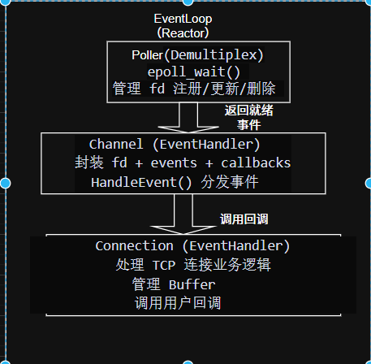
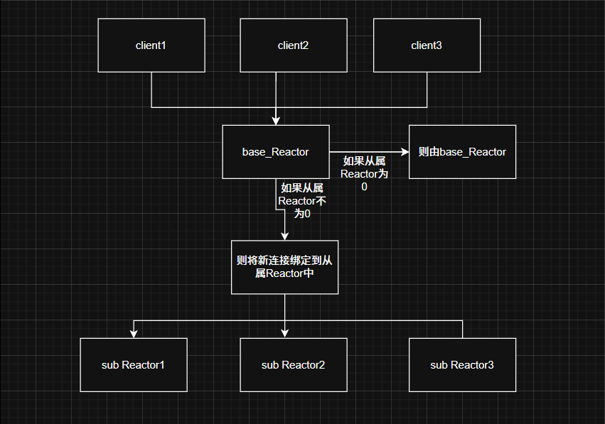

# LCZMuduo - 高性能 C++ 网络库

作者：lczllx
邮箱：2181719471@qq.com
GitHub: [lczllx](https://github.com/lczllx)
开发环境：Ubuntu VS Code
编译器：g++
编程语言：C++

## 项目编译

项目编译时是基于cmake的，拉取后使用cmake编译即可
```bash
# 克隆项目
git clone https://github.com/lczllx/muduo.git
cd muduo

# 编译项目
mkdir build && cd build
cmake ..
make -j$(nproc)

# 运行示例（从build目录）
../bin/test

# 或者从项目根目录运行
./bin/test
```

## 库的安装

在项目源码的/autoinstall 目录里面有一个install.sh文件，直接用root权限运行即可编译和安装

## 项目测试

写了一个简单的回显服务器用于测试，在项目源码的/example 目录下的test.cc

### QPS测试
| 并发数 | 接口 | 测试时长 | QPS | 说明 |
|--------|------|----------|-----|------|
| 1000   | /index.html | 30秒 | **8,700+** | 小文件请求 |
| 500    | /index.html | 30秒 | **8,800+** | 小文件请求 |
| 200    | /hello | 30秒 | **10,000+** | API接口，响应小 |
| 1000   | /hello | 60分钟 | **10255** | API接口，响应小 |

### 网络吞吐量
- **1000并发**: 13+ MB/s
- **500并发**: 13+ MB/s

### 文件传输
- **单连接**: 47 MB/s（10MB文件）
- **10并发**: 74 MB/s（总吞吐量）

## 项目概述

这是一个基于 C++11 开发的高性能网络库，主要是将陈硕的 muduo 网络库核心代码进行重写，将原来依赖boost库的地方都替换成了C++ 11语法，主要是为了学习、了解网络库的架构和组成，以及对网络编程的知识进行复习

## muduo网络库的Reactor模型

在muduo库中采用的是reactor模型，Reactor模型是什么呢
Reactor：即非阻塞同步I/O模型，可以这么理解---应用程序向内核注册感兴趣的事件（可读，可写），内核在事件就绪时通知应用程序，应用程序自己执行实际的I/O操作
Proactor：异步I/O模型。应用程序发起I/O操作时，不仅注册事件，还提供缓冲区。事件来了，内核完成整个I/O操作（如读取数据到缓冲区）后，再通知应用程序

## muduo库设计

reactor模型在实际设计中大概有以下几个部分：
Event：事件
Reactor：反应堆
Demultiplex：多路事件分发器
EventHandler：事件处理器

调用关系：
1. EventHandler注册Event到Reactor
2. Reactor将Event交给Demultiplex进行监控
3. Demultiplex检测到Event就绪，通知Reactor
4. Reactor将就绪的Event分发给对应的EventHandler处理



上面是一个reactor反应堆中所执行的流程，在muduo代码中的关系如下：

可以看到，EventLoop就是reactor，每一个都执行在一个线程上，形成one thread one loop的设计。每一个EventLoop中，有一个Poller和很多Channel，实现对多个连接的管理，Poller对应的就是Demultiplex（多路事件分发器），Channel对应的就是Event（事件）



但是作为支撑高并发的网络库，单线程往往不能达到想要的效果

因此muduo采用了和Nginx相似的操作，有一个base reactor通过accept组件负责处理新的客户端连接，并将新连接分派给各个从属 reactor，每个从属reactor是负责一个或者多个连接的读写等工作。


## muduo里面的类
### CallbackTypes

主要是在里面定义了定义回调函数类型和连接状态枚举（因为都是在类外，所以统一放到一个头文件中）

### 类型定义

- `using TaskFunc = std::function<void()>` - 任务函数
- `using ReleaseFunc = std::function<void()>` - 释放函数
- `using PtrConnection = std::shared_ptr<Connection>` - 连接指针
- `enum ConneStatus` - 连接状态枚举
  - `DISCONNECTED` - 连接关闭状态
  - `CONNECTING` - 连接建立状态
  - `CONNECTED` - 通信状态
  - `DISCONNECTING` - 待关闭状态
- `using ConnectedCallBack = std::function<void(const PtrConnection&)>` - 连接建立回调
- `using ClosedCallBack = std::function<void(const PtrConnection&)>` - 连接关闭回调
- `using MessageCallBack = std::function<void(const PtrConnection&, Buffer*)>` - 消息回调
- `using AnyEventCallBack = std::function<void(const PtrConnection&)>` - 任意事件回调


### Buffer

这个类用于用户态的缓冲区，对接收发送的数据进行缓冲，有一个读偏移、一个写偏移和一个连续空间

read到write是可读数据，buffer.begin()到read+write是buffer.end()是可写空间---空间足够时会移动数据然后更新读写偏移，不够时会扩容


### 成员变量

**private:**
- `uint64_t _read_idx` - 读偏移
- `uint64_t _write_idx` - 写偏移
- `std::vector<char> _buffer` - 连续空间

### 函数声明

**public:**
- `Buffer()` - 构造函数
- `char* Begin()` - 空间起始位置
- `char* GetWritePtr()` - 获取写位置（内联）
- `char* GetReadPtr()` - 获取读位置（内联）
- `uint64_t HeadIdleSize()` - 缓冲区起始空间大小（内联）
- `uint64_t TailIdleSize()` - 缓冲区末尾空间大小（内联）
- `size_t ReadableBytes()` - 可读空间大小（内联）
- `void MoveReadoffset(uint64_t len)` - 读偏移向后移动
- `void MoveWriteoffset(uint64_t len)` - 写偏移向后移动
- `void EnsureWritableBytes(uint64_t len)` - 确保可写空间足够
- `void Write(const void* data, uint64_t len)` - 写入数据
- `void WriteAndpush(const void* data, uint64_t len)` - 写入char*并移动写偏移
- `void Writestring(const std::string& data)` - 写入string
- `void WritestringAndpush(const std::string& data)` - 写入string并移动写偏移
- `void WriteBuffer(Buffer& data)` - 写入buffer
- `void WriteBufferAndpush(Buffer& data)` - 写入buffer并移动写偏移
- `void Read(void* buf, uint64_t len)` - 读取len数据
- `std::string ReadAsstring(uint64_t len)` - 读取len数据并以string返回
- `void ReadAndpop(void* buf, uint64_t len)` - 读取len数据并移动读偏移
- `std::string ReadAsstringandpop(uint64_t len)` - 读取len数据并以string返回并移动读偏移
- `char* FindcrLf()` - 寻找换行字符
- `std::string GetLine()` - 获取一行
- `std::string GetLineAndPop()` - 获取一行并移动读偏移
- `void clear()` - 重置缓冲区状态

### Any

这是自定义的通用类型容器，保存不同类型的数据，控制协议处理的上下文来控制处理节奏，也可以换成c++17的any

### 成员变量

**private:**
- `Base* _content` - 父类指针，利用多态实现类型擦除，方便使用者的获取调用

**内部类:**
- `class Base` - 基类
  - `virtual ~Base() = default`
  - `virtual const std::type_info &type() const = 0`
  - `virtual Base *clone() const = 0`
- `template<typename T> class Derived : public Base` - 派生类
  - `T _value` - 存储的值

### 函数声明

**public:**
- `Any()` - 默认构造函数
- `~Any()` - 析构函数
- `template<typename T> Any(const T &value)` - 模板构造函数
- `Any(const Any &other)` - 拷贝构造函数
- `Any(Any &&other) noexcept` - 移动构造函数
- `template<typename T> Any &operator=(const T &val)` - 赋值运算符
- `Any &operator=(const Any &other)` - 拷贝赋值运算符
- `Any &swap(Any &other)` - 交换
- `bool has_value() const` - 是否有值
- `template<typename T> T *get()` - 获取值（非const）
- `template<typename T> const T *get() const` - 获取值（const）
- `const std::type_info &type() const` - 获取类型信息
- `void reset() noexcept` - 重置


### Logger

这是一个日志类，只是一个简单的类似日志宏功能的类，针对更加详细具体的日志实现在另外一个项目日志器中

### 成员变量

**private:**
- `LogLevel _level` - 日志级别
- `std::string _message` - 日志消息

### 枚举

- `enum LogLevel`
  - `DEBUG = 0`//调试日志输出
  - `INFO`//正常日志输出
  - `WARN`//警告日志输出
  - `ERROR`//错误日志输出
  - `FATAL`//致命错误日志输出

### 函数声明

**public:**
- `Logger(LogLevel level)` - 构造函数
- `~Logger()` - 析构函数
- `template<typename... Args> void operator()(const char* format, Args... args)` - 支持格式化输出（内联）
- `void operator()(const char* msg)` - 支持字符串参数
- `void operator()(const std::string& msg)` - 支持string参数

**private:**
- `static const char* LevelToString(LogLevel level)` - 将日志级别转换为字符串
- `static std::string GetCurrentTime()` - 获取当前时间

### 宏定义

- `#define L_DEBUG muduo::Logger(muduo::DEBUG)`
- `#define L_INFO  muduo::Logger(muduo::INFO)`
- `#define L_WARN  muduo::Logger(muduo::WARN)`
- `#define L_ERROR muduo::Logger(muduo::ERROR)`
- `#define L_FATAL muduo::Logger(muduo::FATAL)`

使用宏定义，在使用时调用L_DEBUG()就可以进行打印


### Channel

这是对所有描述符，包含监听套接字描述符、连接描述符、eventfd等进行管理的一个类，让对于描述符的监控事件在用户态更容易维护，以及触发事件后的操作流程更加清晰
### 成员变量

**private:**
- `EventLoop* _loop` - 关联的EventLoop
- `int _fd` - 文件描述符
- `uint32_t _events` - 当前需要监控的事件
- `uint32_t _revents` - 当前连接触发的事件
- `EventCallback _read_cb` - 可读回调
- `EventCallback _write_cb` - 可写回调
- `EventCallback _error_cb` - 错误回调
- `EventCallback _close_cb` - 连接断开回调
- `EventCallback _event_cb` - 任意事件回调

**类型定义:**
- `using EventCallback = std::function<void()>`

### 函数声明

**public:**
- `Channel(EventLoop *loop, int fd)` - 构造函数
- `int Fd() const` - 获取描述符fd（内联）
- `uint32_t Events()` - 获取当前事件（内联）
- `void SetREvent(uint32_t events)` - 设置当前触发事件（内联）
- `void SetReadCallback(const EventCallback& cb)` - 设置读回调（内联）
- `void SetWriteCallback(const EventCallback& cb)` - 设置写回调（内联）
- `void SetErrorCallback(const EventCallback& cb)` - 设置错误回调（内联）
- `void SetCloseCallback(const EventCallback& cb)` - 设置关闭回调（内联）
- `void SetEventCallback(const EventCallback& cb)` - 设置任意事件回调（内联）
- `bool ReadAble() const` - 描述符是否可读（内联）
- `bool WriteAble() const` - 描述符是否可写（内联）
- `void EnableRead()` - 对描述符监控可读
- `void EnableWrite()` - 对描述符监控可写
- `void DisableRead()` - 解除可读事件监控
- `void DisableWrite()` - 解除可写事件监控
- `void DisableAll()` - 解除所有事件监控
- `void Remove()` - 移除监控
- `void Update()` - 更新监控
- `void HandleEvent()` - 事件处理，根据revents确定触发的事件，调用对应回调

### Poller

这个类主要是对epoll进行封装的一个类，也就是底层的demultiplex（多路事件分发），里面有一个就绪事件数组和一个描述符与其对应channel指针的映射表
### 成员变量

**private:**
- `int _epfd` - epoll文件描述符
- `struct epoll_event _evs[MAX_EPOLLEVENTS]` - 就绪事件数组
- `std::unordered_map<int, Channel *> _channels` - 管理描述符和对应的channel

**宏定义:**
- `#define MAX_EPOLLEVENTS 1024`

### 函数声明

**public:**
- `Poller()` - 构造函数
- `void UpdateEvent(Channel *channel)` - 更新事件监控
- `void RemoveEvent(Channel *channel)` - 移除事件监控
- `void Poll(std::vector<Channel *> *active)` - 开始监控，获取就绪channel

**private:**
- `void Update(Channel *channel, int op)` - 根据具体操作类型更新epoll
- `bool HasChannel(Channel *channel)` - 查找需要更新事件的描述符存不存在

### Connection

**功能**：对通信连接进行管理的模块，对socket，buffer，channel的整合，由组件使用者设置各种回调

### 成员变量

**private:**
- `uint64_t _conne_id` - 连接唯一id
- `uint64_t _timer_id` - 定时器唯一id，这里使用_conne_id
- `int _sockfd` - 连接套接字描述符
- `bool _enable_inactive_release` - 是否启动非活跃连接销毁
- `EventLoop* _loop` - 连接关联的eventloop
- `ConneStatus _status` - 连接状态
- `Socket _socket` - Socket对象
- `Channel _conne_channel` - Channel对象
- `Buffer _in_buffer` - 输入缓冲区
- `Buffer _out_buffer` - 输出缓冲区
- `Any _context` - 协议上下文管理
- `ConnectedCallBack _connected_cb` - 连接建立成功回调
- `ClosedCallBack _closed_cb` - 连接关闭回调
- `MessageCallBack _message_cb` - 有新数据接收成功的回调
- `AnyEventCallBack _event_cb` - 任意事件回调
- `ClosedCallBack _server_closed_cb` - 组件内的连接关闭回调

### 函数声明

**public:**
- `Connection(EventLoop *loop, uint64_t cone_id, int sockfd)` - 构造函数
- `~Connection()` - 析构函数
- `int Fd() const` - 获取管理的文件描述符（内联）
- `int Id() const` - 获取链接id（内联）
- `bool Connected() const` - 判断连接是否处于CONNECTED（内联）
- `void SetContext(const Any &context)` - 设置上下文（内联）
- `Any *GetContext()` - 获取上下文信息（内联）
- `void SetConnectedCallBack(const ConnectedCallBack &connected_cb)` - 设置连接建立回调（内联）
- `void SetClosedCallBack(const ClosedCallBack &closed_cb)` - 设置连接关闭回调（内联）
- `void SetMessageCallBack(const MessageCallBack &message_cb)` - 设置消息回调（内联）
- `void SetAnyEventCallBack(const AnyEventCallBack &event_cb)` - 设置任意事件回调（内联）
- `void SetServerClosedCallBack(const ClosedCallBack &cb)` - 设置服务器关闭回调（内联）
- `void Established()` - 连接获取后，所处的状态进行各种设置，设置事件回调，启动读监控，调用连接建立完成的回调
- `void Send(const char *data, size_t len)` - 发送数据，数据放到发送缓冲区
- `void EnableInactiveRelease(int sec)` - 启动非活跃销毁
- `void CancelInactiveRelease()` - 取消非活跃销毁
- `void Shutdown()` - 提供给使用者的关闭接口
- `void Release()` - 释放接口
- `void Upgrade(const Any &context, const ConnectedCallBack &connected_cb, const ClosedCallBack &closed_cb, const MessageCallBack &message_cb, const AnyEventCallBack &event_cb)` - 切换协议

**private:**
- `void HandleRead()` - 描述符触发可读
- `void HandleWrite()` - 描述符触发可写
- `void HandleClose()` - 描述符触发关闭
- `void HandleError()` - 描述符触发错误
- `void HandleEvent()` - 描述符触发任意事件
- `void EstablishedInLoop()` - 在EventLoop线程中建立连接
- `void ReleaseInLoop()` - 在EventLoop线程中释放连接
- `void ShutdownInLoop()` - 在EventLoop线程中关闭连接
- `void SendInLoop(Buffer buf)` - 在EventLoop线程中发送数据
- `void EnableInactiveReleaseInLoop(int sec)` - 在EventLoop线程中启动非活跃销毁
- `void CancelInactiveReleaseInLoop()` - 在EventLoop线程中取消非活跃销毁
- `void UpgradeInLoop(const Any &context, const ConnectedCallBack &connected_cb, const ClosedCallBack &closed_cb, const MessageCallBack &message_cb, const AnyEventCallBack &event_cb)` - 在EventLoop线程中切换协议

---


### EventLoop

每一个EventLoop对应一个线程，是Reactor模式的核心组件。它整合了Channel、Poller和TimingWheel，通过Poller监控文件描述符的I/O事件，通过Channel管理事件回调，通过TimingWheel实现连接定时销毁和定时任务执行
### 成员变量

**private:**
- `std::thread::id _thread_id` - 线程id
- `int _eventfd` - 事件通知描述符，唤醒io事件监控中有可能的阻塞
- `Poller _poller` - Poller对象
- `std::unique_ptr<Channel> _event_channel` - eventfd的Channel
- `std::vector<Tasks> _task` - 任务队列
- `std::mutex _mutex` - 互斥锁
- `TimingWheel _timerwheel` - 定时器时间轮

**eventfd说明**：`_eventfd`用于在没有I/O事件处理，eventloop处于epoll_wait时，但是这个时候又有任务放入要执行，唤醒eventloop。

pipe/socketpair：需要两个文件描述符（读端+写端），eventfd 只需一个，更轻量，并且_eventfd是系统调用不会阻塞主线程，线程安全，8字节大小开销小

**类型定义:**
- `using Tasks = std::function<void()>`

### 函数声明

**public:**
- `EventLoop()` - 构造函数
- `void Start()` - 启动eventloop
- `void RunInLoop(const Tasks& t)` - 判断要执行的任务是不是在当前线程，不是就压入任务池，是就执行
- `void TasksInLoop(const Tasks& t)` - 将操作加入任务池
- `bool IsInLoop()` - 判断当前线程是不是在Eventloop所在线程里面
- `void UpdateEvent(Channel* channel)` - 更新描述符的事件监控
- `void RemoveEvent(Channel* channel)` - 移除描述符的事件监控
- `void TimerAdd(uint64_t id, uint32_t delay, const TaskFunc& cb)` - 添加定时器
- `void TimerReflesh(uint64_t id)` - 刷新定时器
- `void TimerCancel(uint64_t id)` - 取消定时
- `bool HasTimer(uint64_t id)` - 是否有这个定时器
- `void AssertInLoop()` - 断言在eventloop线程里面

**private:**
- `void RunAllTask()` - 运行任务池所有任务
- `static int CreateEventfd()` - 创建eventfd
- `void ReadEventfd()` - 读取eventfd
- `void WeakupEventfd()` - 唤醒eventfd

EventLoop的核心是对epoll的封装，在epoll_create创建epoll实例、注册各个channel之后，EventLoop就处于epoll_wait阻塞状态等待I/O事件。如果此时没有I/O事件发生，但其他线程需要向EventLoop提交任务（如新连接操作、发送数据等），就通过eventfd写入数据触发可读事件，从而唤醒阻塞在epoll_wait的EventLoop线程，使其能够及时处理任务队列中的任务。

### LoopThread

EventLoop和线程的封装类，负责创建一个线程并在该线程内创建EventLoop实例。通过互斥锁和条件变量实现同步，确保外部调用Getloop()时能够安全获取到已初始化的EventLoop指针，然后启动事件循环

### 成员变量

**private:**
- `std::mutex _mutex` - 互斥锁
- `std::condition_variable _cond` - 条件变量，结合互斥锁实现loop获取同步关系
- `EventLoop* _loop` - 在线程内实例化eventloop指针
- `std::thread _thread` - eventloop对应线程

### 函数声明

**public:**
- `LoopThread()` - 构造函数
- `EventLoop* Getloop()` - 获取EventLoop指针

**private:**
- `void ThreadEntry()` - 实例化eventloop对象并启动eventloop

这里使用的是C++11的thread类，没有使用Linux的系统调用pthread。one thread one loop的关键在eventloop和thread的组合，达成一个线程一个eventloop。

```cpp
void LoopThread::ThreadEntry() {
    EventLoop loop;
    {
        std::unique_lock<std::mutex> lock(_mutex);
        _loop = &loop;
        _cond.notify_all();//loop实例化完唤醒可能的阻塞
    }
    loop.Start();//启动eventloop
}

EventLoop* LoopThread::Getloop() {
    EventLoop* loop = nullptr;
    {
        std::unique_lock<std::mutex> lock(_mutex);
        _cond.wait(lock, [&](){ return _loop != nullptr; });//阻塞至loop实例化完成
        loop = _loop;
    }
    return loop;
}
```

### LoopThreadPool

管理多个LoopThread的线程池类，实现主从Reactor模式。负责创建多个从属线程（每个线程对应一个EventLoop），并通过rr轮转方式分配EventLoop给新连接。当线程数为0时，返回主Reactor（base_loop）处理所有连接

### 成员变量

**private:**
- `int _thread_cnt` - 线程数量
- `int _next_loop_idx` - 下一个线程索引
- `EventLoop* _base_loop` - 主reactor
- `std::vector<EventLoop*> _loop` - 用于分配eventloop
- `std::vector<std::unique_ptr<LoopThread>> _threads` - 保存LoopThread

### 函数声明

**public:**
- `LoopThreadPool(EventLoop* base_loop)` - 构造函数
- `void SetThreadCnt(int cnt)` - 设置线程数量
- `void Create()` - 创建所有从属线程，为每个线程创建LoopThread对象，获取其EventLoop指针并保存到_loop数组中
- `EventLoop* NextLoop()` - 采用轮转（round-robin）方式分配EventLoop，当线程数为0时返回base_loop


---

### Acceptor

属于主Reactor，对监听套接字进行管理的模块。当新连接到来时，监听套接字触发可读事件，Acceptor调用accept()获取新连接的fd，然后通过回调函数通知TcpServer创建Connection对象并分发到从属Reactor


### 成员变量

**private:**
- `Socket _socket` - 监听套接字
- `EventLoop* _loop` - 关联的EventLoop
- `Channel _acpt_channel` - 用于对监听套接字进行事件管理
- `AcceptorFunc _acpt_cb` - 新连接回调

### 函数声明

**public:**
- `Acceptor(EventLoop* loop, int port)` - 构造函数
- `void SetAcceptorCallBack(const AcceptorFunc& acpt_cb)` - 设置新连接回调
- `void Listen()` - 开始监听接口

**private:**
- `void HandleRead()` - 处理新连接，调用accept()获取新连接fd，然后调用_acpt_cb回调
- `int CreateServer(int port)` - 创建监听套接字并绑定端口

---

### Socket

主要是将对套接字的操作进行封装，简化外部操作
### 成员变量

**private:**
- `int _sockfd` - 套接字文件描述符

**宏定义:**
- `#define MAX_LISTEN 1024` - 最大监听连接数

### 函数声明

**public:**
- `Socket()` - 默认构造函数
- `Socket(int fd)` - 使用已有fd构造
- `~Socket()` - 析构函数
- `int Fd()` - 获取文件描述符（内联）
- `void Close()` - 关闭套接字（内联）
- `bool Create()` - 创建套接字
- `bool Bind(const std::string &ip, uint16_t port)` - 绑定地址信息
- `bool Listen(int backlog = MAX_LISTEN)` - 开始监听
- `bool Connect(const std::string &ip, uint16_t port)` - 向服务器发起连接
- `int Accept()` - 获取新连接，返回描述符
- `ssize_t Recv(void *buf, size_t len, int flag = 0)` - 接收数据
- `ssize_t NonBlockRecv(void *buf, size_t len)` - 非阻塞接收数据
- `ssize_t Send(const void *buf, size_t len, int flag = 0)` - 发送数据
- `ssize_t NonBlockSend(const void *buf, size_t len)` - 非阻塞发送
- `bool CreateServer(uint16_t port, const std::string &ip = "0.0.0.0", bool block_flag = false)` - 创建监听连接
- `bool CreateClient(uint16_t port, const std::string &ip)` - 创建客户端连接
- `void ReuseAdderess()` - 开启地址端口重用，防止缓冲区没有数据时阻塞
- `void NoBlock()` - 设置套接字为非阻塞

### TcpServer

整合前面的所有模块，提供给组件使用者搭建服务器

### 成员变量

**private:**
- `uint64_t _next_id` - 连接id，目前是自增
- `int _port` - 服务器监听的端口
- `int _timeout` - 超时时间
- `bool _enable_inactive_release` - 是否启动非活跃连接销毁
- `EventLoop _base_loop` - 主reactor
- `Acceptor _acceptor` - 监听套接字的管理对象
- `LoopThreadPool _pool` - 从属线程池
- `std::unordered_map<uint64_t, PtrConnection> _connections` - 保存管理所有的连接对应的指针
- `ConnectedCallBack _connected_cb` - 使用者设置给connection模块的回调
- `ClosedCallBack _closed_cb` - 连接关闭回调
- `MessageCallBack _message_cb` - 消息回调
- `AnyEventCallBack _event_cb` - 任意事件回调
- `ClosedCallBack _server_closed_cb` - 服务器关闭回调

主要有acceptor，loopthreadpool，eventloop，connection，channel和一些回调。

### 函数声明

**public:**
- `TcpServer(int port)` - 构造函数
- `void SetThreadCnt(int cnt)` - 设置线程池数量
- `void SetConnectedCallBack(const ConnectedCallBack& connected_cb)` - 设置连接建立回调
- `void SetClosedCallBack(const ClosedCallBack& closed_cb)` - 设置连接关闭回调
- `void SetMessageCallBack(const MessageCallBack& message_cb)` - 设置消息回调
- `void SetAnyEventCallBack(const AnyEventCallBack& event_cb)` - 设置任意事件回调
- `void SetServerClosedCallBack(const ClosedCallBack& cb)` - 设置服务器关闭回调
- `void EnableInactiveRelease(int timeout)` - 启动非活跃连接销毁
- `void RunAfter(const std::function<void()>& task, int delay)` - delay秒过后执行任务一个task
- `void Start()` - 启动

**private:**
- `void RemoveConnection(const PtrConnection& conne)` - 移除连接信息
- `void NewConnection(int fd)` - 为新连接构造一个connection进行管理
- `void RemoveConnectionInLoop(const PtrConnection& conne)` - 在EventLoop线程中移除连接
- `void RunAfterInLoop(const std::function<void()>& task, int delay)` - 在EventLoop线程中添加定时任务，使用_next_id作为定时器ID（注意：可能与连接ID冲突，建议使用独立的ID生成器）

可以看到私有的几个函数和start都是很重要的：

```cpp
void TcpServer::Start()
{
    _pool.Create(); // 创建线程池的从属线程
    _acceptor.SetAcceptorCallBack(std::bind(&TcpServer::NewConnection, this, std::placeholders::_1));//收到新连接的回调
    _acceptor.Listen(); // 将监听套接字挂到baseloop上面开始事件监控
    _base_loop.Start();//启动主Reactor事件循环
}
```

主要是先创建线程池的从属线程，然后为acceptor绑定新连接到来的回调，然后开始监听新连接，最后启动主reactor的事件循环，等待事件的到来。

```cpp
void TcpServer::NewConnection(int fd)
{
    _next_id++;
    PtrConnection conne(new Connection(_pool.NextLoop(), _next_id, fd));
    conne->SetMessageCallBack(_message_cb);
    conne->SetClosedCallBack(_closed_cb);
    conne->SetConnectedCallBack(_connected_cb);
    conne->SetAnyEventCallBack(_event_cb);
    conne->SetServerClosedCallBack(std::bind(&TcpServer::RemoveConnection, this, std::placeholders::_1));
    if (_enable_inactive_release)
        conne->EnableInactiveRelease(_timeout);
    conne->Established();
    _connections.insert(std::make_pair(_next_id, conne));
}
```

内部的操作已经被封装了，所以新连接回调只需要传递要绑定的从属reactor、连接id和描述符就可以创建新连接了，然后再设置各种回调，然后再看看有没有启动非活跃连接超时销毁，有就设置上，最后启动事件监控，将新连接管理起来。

```cpp
Connection::Connection(EventLoop *loop, uint64_t cone_id, int sockfd)
    : _conne_id(cone_id), _sockfd(sockfd), _enable_inactive_release(false), _loop(loop), _status(CONNECTING), _socket(sockfd), _conne_channel(loop, sockfd)
{
    _conne_channel.SetCloseCallback(std::bind(&Connection::HandleClose, this));
    _conne_channel.SetReadCallback(std::bind(&Connection::HandleRead, this));
    _conne_channel.SetWriteCallback(std::bind(&Connection::HandleWrite, this));
    _conne_channel.SetErrorCallback(std::bind(&Connection::HandleError, this));
    _conne_channel.SetEventCallback(std::bind(&Connection::HandleEvent, this));
}
```

如果连接关闭就调用shutdown，然后自动调用RemoveConnection，移除连接在TcpServer里面的管理，然后底层自动调用另外的关闭回调，移除监控。

```cpp
void TcpServer::RemoveConnectionInLoop(const PtrConnection &conne)
{
    int id = conne->Id();
    _connections.erase(id);
}

// 描述符触发挂断事件
void Connection::HandleClose()
{
    if (_in_buffer.ReadableBytes() > 0 && _message_cb)
    {
        _message_cb(shared_from_this(), &_in_buffer);
    }
    return Release();
}

void Connection::ReleaseInLoop()
{
    if (_status == DISCONNECTED)
        return;              // 防止重复释放
    _status = DISCONNECTED;  // 修改链接状态
    _conne_channel.Remove(); // 移除监控
    _socket.Close();         // 关闭描述符
    if (_loop->HasTimer(_conne_id))
        CancelInactiveReleaseInLoop(); // 如果有定时任务，取消
    if (_closed_cb)
        _closed_cb(shared_from_this()); // 调用关闭回调
    if (_server_closed_cb)
        _server_closed_cb(shared_from_this()); // 移除服务器内部管理的链接信息
}
```

---

## 总结

整个muduo的大概流程：
1.创建TcpServer时自动创建base_loop，作为主reactor，同时创建Acceptor和LoopThreadPool
2.设置从属线程数量，如果设置的线程数量为0，那主reactor不仅负责接收新连接还负责处理I/O事件，设置TcpServer的各种事件回调
3.调用Start()时，先创建从属线程池，然后设置Acceptor的新连接回调，接着Acceptor.listen()将监听套接字注册到主reactor的Poller，最后启动主reactor的事件循环
4.主reactor在事件循环中等待新连接到来，当监听套接字有可读事件时，Acceptor的Channel触发HandleRead回调
5.当新连接到来时，Acceptor调用accept()获取新连接的fd，然后调用TcpServer::NewConnection()创建Connection对象，在线程池获取一个从属reactor绑定，设置Connection的各种回调，调用Established()启动读事件监控，该连接的所有操作都在绑定的reactor里面进行

## 🙏 致谢

感谢陈硕的 muduo 网络库提供的设计灵感。

## ⭐ 支持项目

如果这个项目对你有帮助，请给它一个 Star！

🐛 发现问题？欢迎提交 Issue

💡 有改进建议？欢迎提交 Pull Request